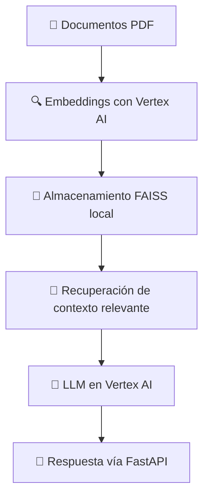

# 🦷 Agente RAG con Vertex AI y FastAPI

Este proyecto implementa un **sistema RAG (Retrieval-Augmented Generation)** para responder preguntas basadas en documentos de una clínica dental.  
Se utiliza **Google Vertex AI** para el modelo de lenguaje y **FAISS** para almacenar y buscar embeddings localmente.

---

## 🚀 Características principales
- Integración con **Vertex AI** usando `langchain_google_vertexai`.
- Vectorización local con **FAISS** para mejorar velocidad y reducir costos.
- API creada con **FastAPI** para consultas rápidas.
- Soporte para habilitar/deshabilitar auditoría de fuentes.
- Fácil despliegue en la nube (Google Cloud Run, Compute Engine, etc.).

---

## 📋 Requisitos previos

1. **Cuenta en Google Cloud** con Vertex AI habilitado.
2. Crear un **Service Account** y descargar el archivo JSON de credenciales.
3. Tener **Python 3.10+** instalado.
4. Tener instalado **Git**.

---

## 🔑 Configuración de Google Cloud

1. Ve a **Google Cloud Console** → [Vertex AI](https://console.cloud.google.com/vertex-ai/)
2. Activa la API de Vertex AI.
3. Crea un **Service Account** con permisos de **Vertex AI User**.
4. Descarga el archivo `.json` de credenciales.
5. Guarda el archivo en el proyecto, por ejemplo:  
   ```bash
   agente-rag/credenciales.json
   ```
6. Exporta la ruta del archivo como variable de entorno:
   ```bash
   export GOOGLE_APPLICATION_CREDENTIALS="ruta/a/credenciales.json"
   ```
   En Windows (PowerShell):
   ```powershell
   setx GOOGLE_APPLICATION_CREDENTIALS "C:\ruta\credenciales.json"
   ```

---

## 📂 Instalación del proyecto

```bash
# Clonar el repositorio
git clone https://github.com/gusqroo/agente-rag-vertexai.git
cd agente-rag-vertexai

# Crear entorno virtual
python -m venv venv
source venv/bin/activate  # En Windows: venv\Scripts\activate

# Instalar dependencias
pip install -r requirements.txt
```

📦 **requirements.txt**
```txt
fastapi==0.116.1
langchain==0.3.27
langchain_community==0.3.27
langchain_google_vertexai==2.0.28
pydantic==2.11.7
python-dotenv==1.1.1
uvicorn==0.35.0
faiss-cpu==1.11.0.post1
```

---

## ⚙️ Variables de entorno

Crear un archivo `.env` en la raíz del proyecto:
```env
GOOGLE_APPLICATION_CREDENTIALS=credenciales.json
VERTEXAI_EMBEDDING_MODEL=gemini-embedding-001
VERTEXAI_LLM_MODEL=gemini-2.5-flash-lite
```

---

## 🏗️ Estructura del proyecto
```plaintext
app/
 ├── chain.py              # Construcción del RAG y configuración del LLM
 ├── document_loader.py    # Carga y procesamiento de documentos PDF
 ├── files/                # Archivos PDF de la clínica dental
 ├── vectores_dental/      # Almacenamiento local de vectores FAISS
 └── main.py               # Servidor FastAPI
.env                       # Variables de entorno
requirements.txt           # Dependencias
```

---

## 🔍 Explicación del flujo



---

## ▶️ Ejecución en local

```bash
uvicorn app.main:app --reload
```

Abrir en el navegador:
```
http://127.0.0.1:8000
```

Ejemplo de consulta:
```
http://127.0.0.1:8000/preguntar/?pregunta=¿Qué servicios ofrece la clínica?
```

---

## 📡 Despliegue en la nube (Google Cloud Run)

1. Autenticarse en Google Cloud:
   ```bash
   gcloud auth login
   gcloud config set project TU_PROYECTO_ID
   ```
2. Construir imagen Docker:
   ```bash
   gcloud builds submit --tag gcr.io/TU_PROYECTO_ID/agente-rag
   ```
3. Desplegar:
   ```bash
   gcloud run deploy agente-rag --image gcr.io/TU_PROYECTO_ID/agente-rag --platform managed
   ```

---

## 🛠 Auditoría de fuentes

En `chain.py` puedes habilitar o deshabilitar la devolución de **fuentes** en las respuestas:  
```python
chain = RetrievalQA.from_chain_type(llm=llm, retriever=retriever, return_source_documents=True)  # Auditoría activada
chain = RetrievalQA.from_chain_type(llm=llm, retriever=retriever, return_source_documents=False) # Auditoría desactivada
```

Recomendación: habilitarla cuando se requiera **transparencia** o validación de datos.

---

## 💡 Posibles mejoras futuras
- 🌐 Integrar autenticación de usuarios.
- 📊 Panel web para consultas y estadísticas.
- 🔍 Indexación automática de nuevos documentos.
- 📱 Integración con canales como Telegram o web widgets.
- 🤖 Ajuste fino de modelos para vocabulario específico.

---
## Si tienes preguntas, sugerencias o deseas colaborar, no dudes en contactarme:

-💼 Nombre: Luis Gustavo Gómez Vargas

-📧 Correo: gusqroo@gmail.com

-🐙 GitHub: @gusqroo

-💼 LinkedIn: linkedin.com/in/gusqroo

---


## 📜 Licencia
Este proyecto se distribuye bajo License 2.0
